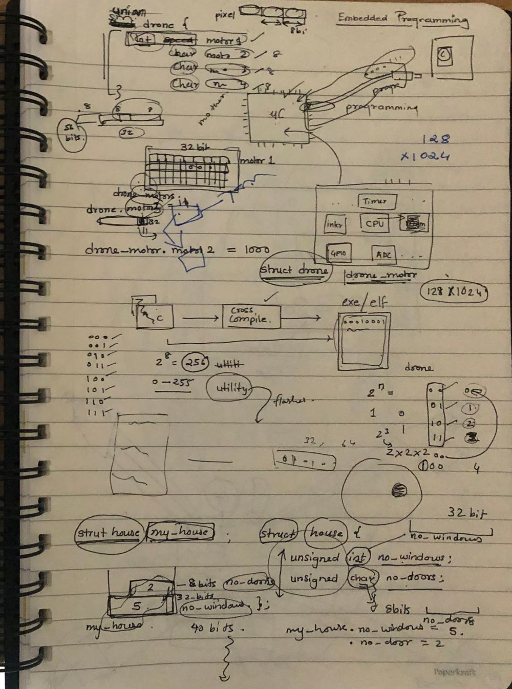
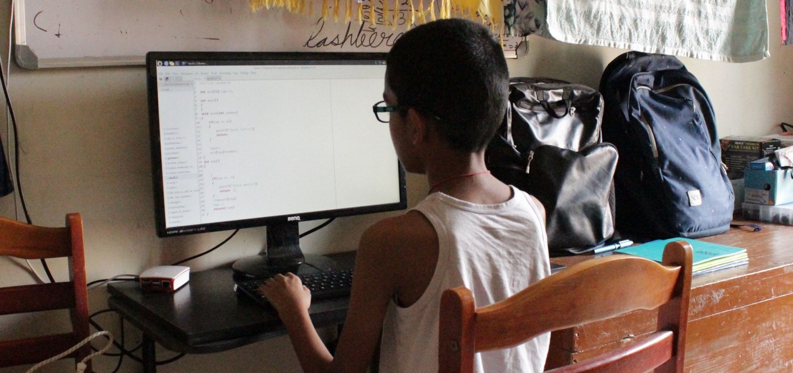
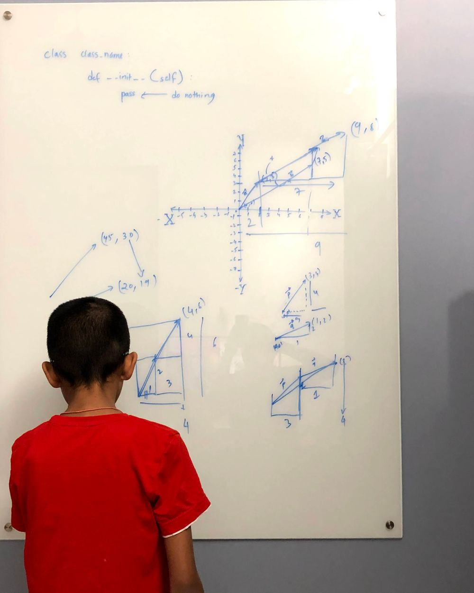

+++
title = 'Embedded Systems and 9 year old!'
description = 'How I got my nephew (9 years of age) to learn to code in C, and how over the next two years he coded a Neural Net.'
image = '5.jpg'
date = 2022-07-10T09:32:17+05:30
tags = [
    "personal"
]
categories = [
    "experiences"
]
+++

I ended up teaching my nephew (9 years of age) to write code in C language and, by extension, learn to program anything in any programming language.

If you are in hurry, here is the gist - I nudged him to learn C when he was a 4th grader. Two years later, he is at a point where he can code in C, Python, Javascript, etc, and adapts to new languages as needed. Has a good idea of the common data structures and algorithms which he seems to have been using to solve problems. His GitHub repositories among other things seem to also have one which implements a [Perceptron](https://github.com/vtarale/cPerceptron/blob/main/src/perceptron.c) and a [Neural Network](https://github.com/vtarale/NNetworks/blob/main/Library/Neural_network.py) library, that too from scratch - No libraries used!

  
    
Languages he has written code in over the past 2 years.

  
    
His current GitHub stats.

Rest of this note documents the journey.

----

# Pandemic, Lock-down, and No School!

My nephew would hound my sister to play with him every day around the time she would plan to prepare lunch. As a way to keep him engaged, she directed him to me and gestured to babysit him! It's painful to handle kids, especially the active grown-up ones!

I had returned a few weeks ago from Mountain View and gotten him one of the Harry Potter books he wanted to read. By this time he had already read through the book and I could tell by having seen him narrate parts of the story to others, that he was itching to share the story, all of it! The glories of the little boy with the mark of a lightning bolt on his forehead that, my nephew silently thought was him.

I figured, one way to keep him engaged would be to play one of the Harry Potter movies. I never read or watched any of them. What happened though was, that he started to guide me through the story — who is who and what is what.  Honestly, it was too much fantasy for me. I was struggling. I couldn't handle it.

The movie had progressed to the Quidditch game! My nephew was excited. A few minutes into the match and I blurted out, "This is fake!". "None of this magic is real!", I continued. He paused the movie. His face clearly showed signs of fractured beliefs. Maybe I shouldn't have been so direct (but that story was too much for me at 29! I could have accepted it at 10... it was really too much at my age!). I said, "I do know magic though. And you can be the Harry who knows real magic. Like real, real magic! Inanimate things doing what you want and stuff like that".

His eyes lit up! (Hope was restored.)

"Well, it does come at a cost...", I said.

"What?", He quickly asked. It is just interesting how curiosity can catch hold of a kid!

"You would need to learn a lot. You, like Harry (I just made this part up, and it seemed to have worked) would need to learn to speak many tongues", I warned. "There would be many subjects that you would need to struggle with, the journey is long and hard... You would need to design all of the magic you want... no spells", I dramatically continued. I actually liked Professor Dumbledore, there was a bit of him I was enacting. "In the end though, all of the magic shall be yours!", I assured him of the reward. I could tell, he was captivated by the idea of knowing the magic. Becoming the magician, yes!!

"I am ready! But how can I learn the magic?", He excitedly asked.

"How about the Golden Snitch? How about we design that, to begin with?",  I proposed. He clearly looked captivated by the thought of it (imagine dilating pupils).

I opened my notebook and started to scribble and discuss with him the properties of the Golden Snitch.

It is tiny. It flies. Moves backward, forwards, etc. I tried to be as detailed as possible. He was nodding for every feature I listed. I presented to him the possibility that a snitch is a drone! And now it was more of an engineering problem! "Engineering is the closest thing to being a magician", I said. "Except, it is real!", I concluded. He was amazed that this would happen and that he would be building that thing.

In the next 3 hours, I walked him through all the bits and pieces he would need to know to build the drone. The physics, the math, the electronics, every damn thing. In fact, I kept peeling the onion as long as he accepted and agreed with the relationship. "The drone needs to fly, but then there is gravity (then some facts about how gravity works and why he should care about it outside of just this problem). You'd need to generate thrust (more physics/mechanics). Rocket motor would do, but it runs out of fuel (some more explanation and physics of why this won't suit). So maybe something like a propeller (more about fluid flow/mechanics). But then you also need to rotate the propellers, so you need a battery (and why the battery would last longer than rocket fuel) and motors (how they work and why he should care). And then, you want to control it, so you need some control system (then some control theory and how almost everything he uses in daily life already has a version of it)", I explained everything in as much detail, answering every question along the way and using it as an opportunity to open his brain to learn more, making him even more curious than before.

By the end of three hours, I had introduced him to the following:
- Newton's three laws of motion.
- Rotational motion.
- Linear motion.
- Faraday's laws of induction.
- Basics of Electricity - voltage, current.
- CPUs, How they work.
- How hardware is designed.
- What is a CPU really and how does it look from the inside.
- How C relates to all of this.
- Embedded Systems Basic.

- The idea of sensors and actuators.
- Algorithmic thinking.
- Some math that can help design all of it - Trigonometry.
- The idea of Calculus - Integration, and Differentiation.
- Everything else that I could think of to design a drone.

Of course, I did not expect him to remember a thing or even understand any of it. My real intention was to make him well aware that such things exist and that they are actually used. This should guard him against the possibility of falling into a trap of thinking "where is this all used?" and maybe, just maybe he'll be able to survive a bad teacher!

And now that he could not wait to learn all of this. I asked him to google and take a look at the Keywords in C language. And in the next 2 hours, he recited them like a parrot!

The next step of course was, what each keyword meant and how it could be used. Stating the definition and drilling down on what the consequences of each of them were, took a day. Everything sinking into him and becoming his second nature took another two months!

# The Setup

His workstation was a Raspberry Pi with a monitor, keyboard, and mouse hooked to it. One of the primary reasons I used a Pi, was it had the GPIO (General Purpose Input Output) pins visible. And I knew very well, at some point he would ask me what those are and then, I would use that as a seed to introduce him to a lot of CPU internals, SoC design, and embedded systems. And I have to mention, he did ask me about those and I did end up educating him about embedded systems.

# C, Compile time errors and growing new muscle!

Anyone who has attempted to code in C knows - the language is unforgiving! You have to get the syntax exactly right. You have to get the data types exactly right! It is so hard to not shoot yourself in the foot!

I wrote the first program for him - the classic "hello world", and explained to him the structure of the program. Then, I gave him problems to solve and implement. As can be imagined, he got nowhere for days on a simple program and would hound me every 2 minutes to help him. I would let him struggle for hours before I gave any hint (I would of course tell him how he could ask Google... ). Occasionally, I would also recommend quitting. But seemed like he had caught the virus, the joy of being able to control the machine and by extension the world. He, however, wouldn't press the exit and call it quits! Good for him!

Before you think of me as a cruel uncle, let me propose to you my reasons for letting him struggle. The idea was simple - "something he needed was denied to him - the help, the easy way out. As a result, he would try and find more information and ways to progress, later with all the information that made no sense, he'd be super confused. When he would be at the breaking point, I would sit him down and offer to help a bit (a glass of ice-cold water for someone in hell!). He would then present everything he researched. I would then ask him questions, the answer to which was in everything he searched online. As a result, all the scattered information would all of a sudden make sense! I was letting him collect as many puzzle pieces only to later help him stick all of those together.

Over the span of the next two months, he developed a lot of code in C. Here's the Git repo if you want to take a look (yes, I also taught him version control along the way!)

> [GitHub link to his projects: vtarale/LearningCode](https://github.com/vtarale/LearningCode)

# Being on his own

At roughly the three-month mark, he had moved on to coding on a laptop (he wanted to avoid sitting on the chair for too long). He would come to me every now and then demanding an interesting problem to solve. I would give him something impossible (as seen by him) to solve and then he would wrestle with it for a couple of weeks.

The fact that he was coming to me for problems opened up opportunities to introduce him to a lot of other fields, for example, I gave him a signal processing problem that required an understanding of Fourier transforms (this did not go well, but at least he knows there is something called Fourier transforms :D).

Problems would be more mathematical in nature in general. Here's a set of videos I took when he was a few weeks into coding in C. He was to compute the perimeter of a triangle or something. You can see him make mistakes and then recover on his own -

1. Watch him write C program from scratch

1. Debugging

1. Debugging continued

1. Success!


# Freedom

He really seems to have become capable of solving complex problems and choosing the language and tools that let him solve in the best way. I took a look at his GitHub Repository and see [repositories on all sorts of things](https://github.com/vtarale?tab=repositories). It is interesting how he has not used external libraries.

I presented to him the problem of vectors and operations on vectors (yes! I ended up teaching him vectors and he implemented the solution). This is him understanding what vectors are and trying to figure out how to capture the idea in code. He then implemented the vector module.

I've seen him work with Arduino, and Raspberry Pi and even dwell into electronics - transistors, digital logic, and RF. All of it was still centered around wanting to make a drone! At some point, he figured he would need to also have ground control of the drone and hence require some sort of communication link. My recommendation was to use RF. And then this happened -

He looked for and ordered an RF transmitter and receiver pair and learned how he could feed the data to it from the I/Os of Raspberry Pi. It was very cool to watch him do that. He soon learned the pain that comes with debugging circuits. I did not force him to do a lot of hardware since I anticipated him hounding me even more. Besides, the point was to enable him to fish and he seemed to have learned that well.

# My wish for him

As he becomes a teenager, I hope he doesn't shoot himself in the foot by getting distracted too much. Irrespective of what he is taught and what kind of teachers he runs into, I hope his internal drive stays strong and that he builds himself into a problem solver.

I wouldn't say he should consider becoming an Engineer. He should become anything that he wants to be! Just that the world should not seem like an enigma or magic. He should be able to look through how things work and then be able to, if not anything else, use them to his advantage.

# My personal learnings

I did not expect him to become so better so fast. I was wanting to just keep him engaged so my sister was free from having to attend to him. It looks like kids really can learn a lot and fast! When I think about it, the fact that he had nothing to worry about, could let his curiosity take control of him and someone around to guide him to find the answers fast, must have enabled rapid learning.

I do believe all this progress may have very little to do with any special abilities he may have as a kid. Based on my observations, he's just a regular kid - energetic, curious, and doesn't care about the world (at least not yet! and good for him!). It seemed to me that all throughout, he was able to relate why what he was learning and doing helped him progress towards a goal he aspired to achieve - be the real Harry!

Along the way, goals and aspirations have stretched. He is beyond the Harry he wanted to become. Looks to me that he has understood he can build anything he wants, and solve any problem that blocks him. And now it's all about spending his time perfecting the craft, learning more details or other subjects. Hopefully, now he understands, the more he knows the details of other subjects, the more quickly and precisely he can solve the problems.

He needs to **learn a lot of other tongues**!
