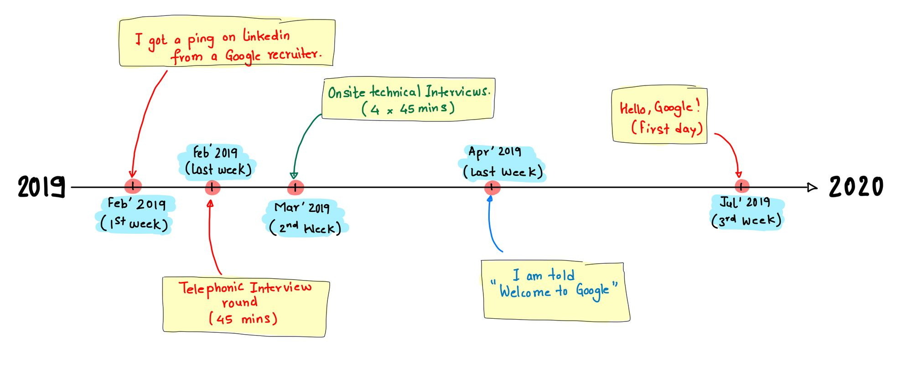
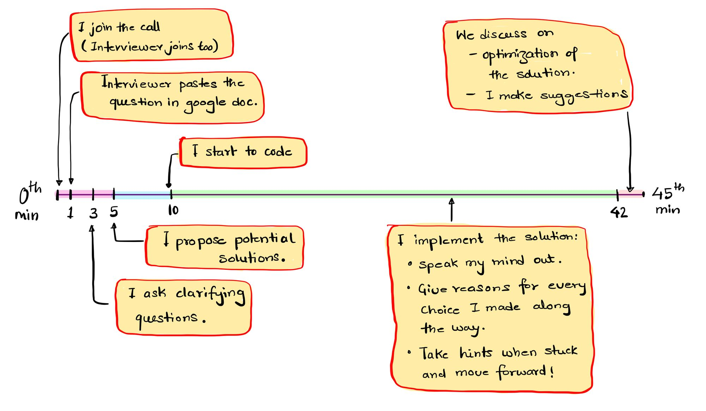
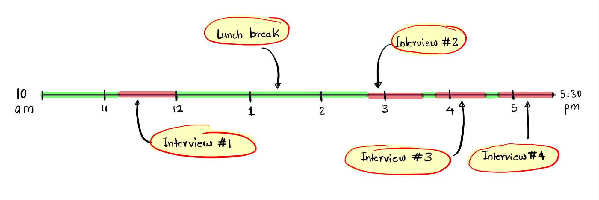
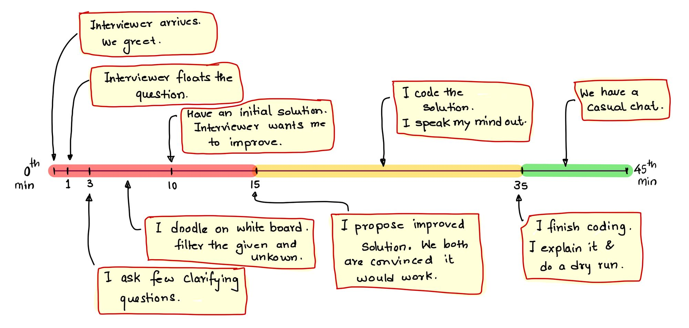
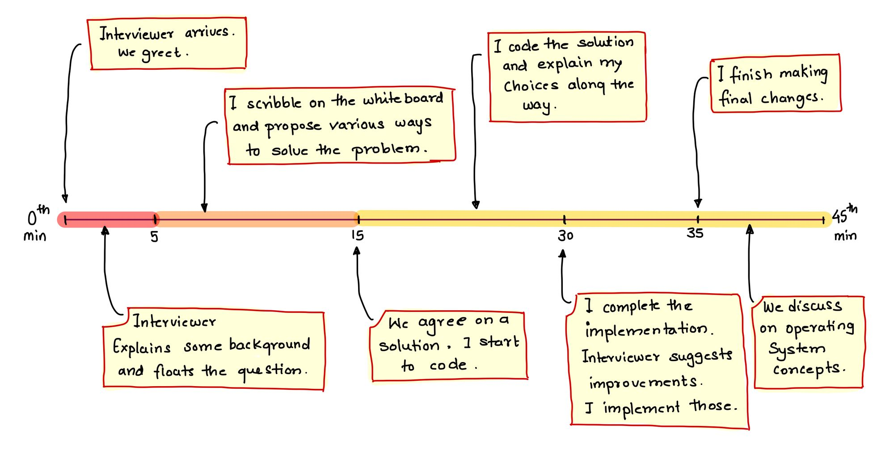
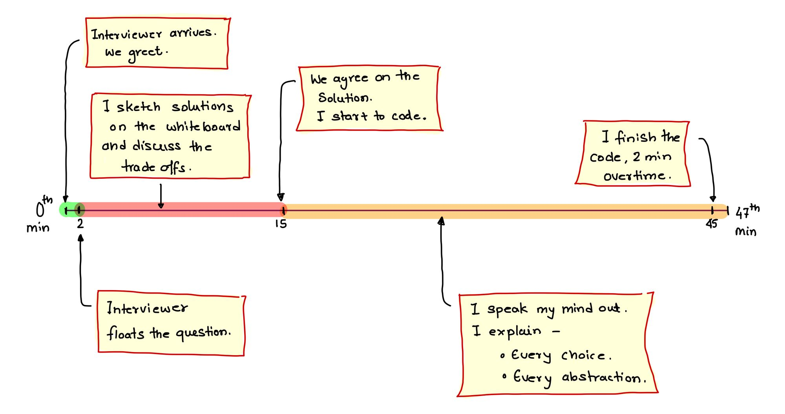
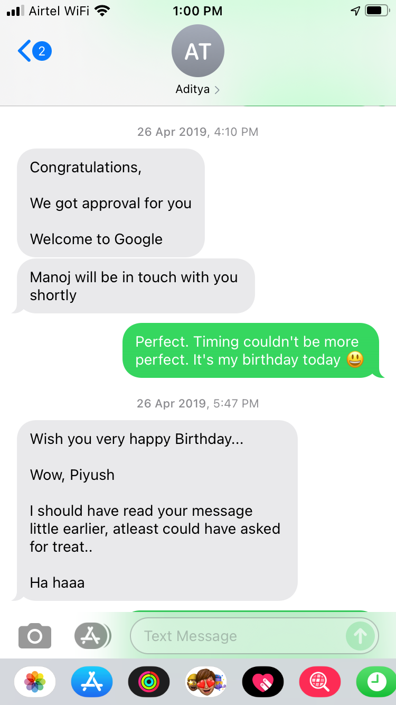
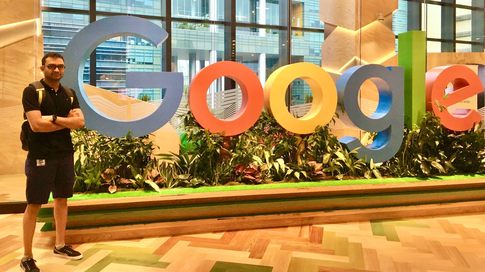

+++
title = 'How I got into Google!'
image = "pg.jpeg"
description = "A quick note on my Google Interview Experience for the position of Software Engineer, Embedded systems."
date = 2021-07-07T08:41:17+05:30
tags = [
    "personal"
]
categories = [
    "career"
]
cover = "pg.jpeg"
author = "Piyush Itankar"
avatar = "/img/avatar.png"
authorlink =  "https://www.linkedin.com/in/streetdogg/"
+++

Been getting a lot of questions about how embedded systems interviews are at Google. Here is a detailed note on my inteview experience at Google from 2019 for the L3 role ...

<!--more-->
---

# Timeline



I was reached out by a Google recruiter [Aditya Tiwary](https://www.linkedin.com/in/aditya-tiwari-755b76161/) in the first week of February 2019. It started as a casual talk about my background and experience and ended with me applying online. This had happened too fast, in less than two days or so. He then asked me for a suitable time for a technical discussion. The same evening, we had a fifteen minutes chat on technical topics. From what I could understand he was probing to understand what kind of role I would fit - software or hardware. Convinced that I favoured being in embedded software more than the hardware, he went on to schedule the telephonic interview two weeks into the future. As pointed in the image above, this would be the last week of February 2019.

# Telephonic Interview Preparation
I did not know what to expect. Embedded Systems is such a vast field to be able to cover everything in two weeks! Besides, I did not have enough experience to talk about everything. [Aditya](https://www.linkedin.com/in/aditya-tiwari-755b76161/) had suggested focusing on the lower hardware abstraction level, data structures, and algorithms. I figured doing operating systems would serve me best! It includes all of the three. I also considered the possibility that it could turn out to be a pure data structures and algorithms interview.

I focused on the following:
1. C language: to deal with memory and embedded type of problems.
1. Python: to deal with a problem that is high level and would take too long to code in C.
1. Being able to reason clearly and justifying any choices I made while implementing the solution. I decided to go through MIT's Introduction to Data structures and Algorithms. I would do the problems in the problem set.
1. Computer Architecture: To answer anything embedded (and around CPUs and Memory).
1. Embedded System Design: I referred to Frank Vahid's book to refresh the design tricks usually used.

I avoided going the competitive programming way. Partly because I don't believe it helps with deeper reasoning. You end up learning spotting patterns in problems and then solving them using a bag of tricks. I wanted to be able to reason well and figured going the academic way should help in general. I also did not have huge hopes; truth be told.

# The Telephonic Interview - the one with a brain freeze moment!



I don't remember exactly, but it must have been scheduled on a Friday, at 10 pm. Such an odd time was because the interviewer was from a different Geo. On Friday, 9:45 pm [Aditya](https://www.linkedin.com/in/aditya-tiwari-755b76161/) called me and motivated me to do well. He suggested listening carefully and reasoning carefully. He also suggested not to hurry while implementing the solution.

The interview went pretty much as in the image above. We (I and the interviewer) both joined on time, greeted each other. The interviewer briefly introduced himself, respectfully suggested that we should jump into the problem directly to save me time. I agreed!

One minute into the interview, he pasted the question on the shared google document and explained. I read through it, asked some clarifying questions, and went on to propose obvious components and expectations that I could immediately see through. The problem seemed deliberately incomplete and open-ended. It looked as though I would need to dig a little to get more data and finalize the expectations. I did that. I mentioned various use-cases and potential areas where such types of things would come up. The interviewer agreed on a few of my interpretations and gave me some more data to narrow down the details of the problem. In few minutes, the expectations were clear.

While I wanted to use **C** as the coding language, I figured **Python** could help me code fast. And because the problem was high-level in nature; **Python** seemed like a natural choice. I first explained a high-level approach. Something like -

> We want X to happen and that seem to depend on A and B as sub-steps. Then C needs to happen on output of A and B to be able to proceed to further process and compute the output for X.

The interviewer agreed and encouraged me that I had the right idea. We were 5-7 minutes into the interview. I began to code and put the skeleton to the solution, in place. As I was doing it, I was also speaking out why I was doing it and how I expected it to help. If I wasn't able to think clearly on any step I would put a comment and move on.

Once the skeleton was in place, I started to fill in the details and make corrections to the functions' interface and return value. This happened for some time. By thirty minute mark, I had the solution in place with one sub-function pending. And for some reason, I had a "**Brain freeze**" moment! I had to implement a nested `for()` loop in the pending sub-function and for some reason, I just wasn't getting the loop index and termination bounds right. I knew very clearly what was to be done. The "how" was the problem because I was not getting the bounds right.

The interviewer hinted by asking questions like - "What happens if say, you chose this as start and that as the end?". I would reasons about it, get some clarity but still wasn't able to narrow on the bounds. After trying for a couple of more minutes, I admitted by joking that I was having a brain freeze and that my Brain had escaped me! I took some more time and managed to write in the bounds. I could not check if it did exactly what I thought it should. I mentioned that to the interviewer.

The interviewer then suggested that we should let the problem be. We were forty minutes into the interview. I had pretty much solved the problem with exception of that one sub-function! Which, I wasn't fully sure about. The interviewer then asked me to comment on the space and runtime complexity of my solution and how I could improve it further. I went loose, commented on space and runtime complexity, and then suggested that if I could break the problem to use threads, attach to different cores and structure the computation to have all the required data in the Caches the execution speed would become -

```
(number of threads) * (number of cores) * (cache hit time)
```

With this, we had reached the end of the interview. The interviewer thanked me for my time. I thanked him for his. Mentioned it was a great experience to be interviewed by a Googler. We hung up.

I was exhausted. [Aditya](https://www.linkedin.com/in/aditya-tiwari-755b76161/) called me to enquire how it went. I suggested I gave my best but ruined the implementation of one sub-function. "I am worried about that being a red flag" I suggested. He suggested not to think about it too much and that we should wait for the recommendation (verdict).

The next morning, [Aditya](https://www.linkedin.com/in/aditya-tiwari-755b76161/) messaged suggesting that I had survived and the feedback was positive. I should now start preparing for the onsite...

When I think back to it. I think it must have been the following facts that helped me score -
1. I was speaking my mind out.
1. Critically thinking through my reasoning.
1. Breaking the larger problem into smaller chunks.
1. Thoroughly using the system properties for optimization.

-----

# Onsite interview preparation

One thing was clear to me, I should not expect only the embedded type of questions in the final interviews. I doubled down on the [MIT lectures](https://ocw.mit.edu/courses/electrical-engineering-and-computer-science/6-006-introduction-to-algorithms-fall-2011/) and solved as many general problems as I could get my hands on. I wanted to develop a mindset that would help me think about any problem and if not anything then, at least give out a design to solve those problems. I felt generalists would be favoured over experts. This was evident from the type of problems this company is involved in solving. The more I knew about different fields the better.

I got myself a whiteboard to practice writing code on. A lot of youtube videos suggested that the interviews happen as a whiteboard discussion. I would keep asking myself all day - How would you design this? How would you code that? All too often, I would find myself unable to solve a problem in C or it would just take too long to fit within the interview time limit of 45 minutes. This then hinted at taking the interviews in a language like Python! I doubled down on that, I did all the practice in Python.

I considered doing competitive programming, but the thing was it has its obvious disadvantages. For example say, you solve a lot of Math problems of the same kind. Does that mean you are good at Math? Likely not, being able to think and the reason is very different from being able to just spot the pattern. There is only so far one can go with pattern-spotting-based problem-solving! Eventually, it catches up. I wanted to improve on my thinking and reasoning. I knew, if one reasons based on numbers, data, and mathematics then one can be sure the reasoning has substance for others to trust. I was thus also doing algorithm analysis.

> I need to mention I also happen to be a slow learner and cannot jump at solving problems that I don't relate to or feel I don't fully understand. This then in general makes it difficult for me to just sit and solve random coding problems...

As the days passed, none of what I was doing gave any hope of me making it in. The more I studied, the more new stuff came up. I realized there is a lot I didn't even know I don't know. Soon, I just left the hope of making it into Google. I decided to pursue the material in the hope that it'll just make me a better engineer. And for just plain intellectual pleasure.

During this time, I also got myself a copy of the book - [Cracking the coding interview](https://www.amazon.in/Cracking-Coding-Interview-Programing-Questions/dp/0984782850/ref=sr_1_3?crid=33V69S4AA6QPQ&dib=eyJ2IjoiMSJ9.ZksI1w6irMzs3sLJmFdw6TFTuA1pMQPMeobwrs8vgyHpvPtoYQT5Y3ez4t2K3o_IrxUpdc2z-b1_FWbKlcLnfGh2ZJQTNftRk7RE0X3YdRoxKMAqpPHXnSjGg-zWSMaHVlXYvgKzdCoJcHG7i4iYM8hx-davMny6NzgnQy8qEo5H_J4lSWBm0_9ECsdbpdNtUsSgde6WdcFnYHxK4IJHA3Xr9Yeb3pTqxacHXRX1IWc.6RNOPytLs6O_tztYoL8sUILWfSyyPcp5yI8SCv9VbwU&dib_tag=se&keywords=cracking+the+coding+interview&qid=1722743487&sprefix=cracking+the+cod%2Caps%2C429&sr=8-3). I just read the text like a Novel. I did not attempt to solve anything on paper.  Just read. The "hiring process" was described in good detail. I understood; even if I made it through all the interviews, there would be a hiring committee that may randomly decide on me. This fact soon resulted in me understanding that maybe Google was not a thing for me. If I got rejected, it would not necessarily mean that I was a bad engineer. I did not want Google interviews to become a validation of my abilities! I decided to stick with doing the basics right and left everything else to luck.

The other thing I specifically did was - browse through a lot of data structures. I would look at the use-case and the data structure that people used. If I understood it quickly, I would remember. If not, I wouldn't force myself to remember it. I intended to build a repository of data structures that I could later use as mix-n-match to solve a problem. This fact, as you will see, served (and still does) me best!

# Onsite Interviews



[Aditya](https://www.linkedin.com/in/aditya-tiwari-755b76161/) came over to escort me to the reception. He then took me in and introduced me to another recruiter - [Ajit](https://www.linkedin.com/in/ajitnathanael/), who would also be helping me navigate around during the day. We met next to the cricket practice net!

> Yes! You read it right. There was a Cricket net around the work area! And then there was golf putting setup in the work area.
>
> Visit to Google offices is a visit to another universe!

"This is a daycare for Engineers!", I told them. It was very unreal! I had only heard of Google culture and workplace fun. Just the sight of it. I so wished I got in!

I told myself my job is to give my best in the first interview. "Take your time, think, ask questions, and reason clearly," I repeated to myself. Both these guys were super positive and kept boosting me up to give my best and not worry about what happens. I was scared but convinced that I should focus on having a good discussion with the interviewer and solving the problem. I should respect their time.

I had four technical interviews that day. All had coding involved (some less than others). One turned out to be a mix of design and coding.

I had been provided with - a Chromebook that I would need to carry around and code. The code would stay in it, and whatever I coded on my screen would be visible to the interviewer on their screen. It was a simple coding environment, and I did not have to compile or run the code. Imagine it to be a shared code editor.

## I figured I would head back home



[Ajit](https://www.linkedin.com/in/ajitnathanael/) escorted me to a small two-seater meeting room with a whiteboard. It was all colourful. Green on this wall, Yellow on that. I felt oddly happy for being there. The interviewer arrived on time. We shook hands, greeted each other, and got to business.

The interviewer typed the password for my Chromebook and got me to the editor. He then told me the problem statement in less than twenty seconds! I had to just implement one function. It had to meet the specifications. The problem seemed straightforward.

> The real trouble was it could not be done in Python!

Python - the language I was using to practice was of no use to solve a problem of this nature. The reason for this was, the problem involved interacting with memory and the use of pointers and the details could not be handled in Python. In my head, I was like, "Looks like I'll go home after this!".

I took a moment to think about the problem. I decided I better use C and let my experience of using it for the past three years take over and guide me (I am good at C!). Not all pieces of the problem were obvious. I drew some diagrams and mentioned to the interviewer everything that I could gather. I then went on to explain the pieces of the problem I did not know but could help me. I made an educated guess about a couple of issues based on what I knew about embedded systems, memory, and C. The interviewer must have liked that (I see myself doing this every day on my job. Everything is so full of ambiguity). I was navigating through ambiguity and bringing more clarity to the problem by reducing the unknowns.

Along the way, I proposed one solution. Something that was table-based. I then also mentioned that it looked like overkill in terms of the space requirement and management. The interviewer agreed, appreciated my solution. Acknowledged that it would work and then naturally hinted to where I should look for optimization. I carefully recorded every word of what he said — mentally. Pondered on it while looking at the sketches on the board.

I repeated out loud what he had mentioned — "So you are suggesting that I should consider if I could reuse what I already have ... ". I did a little more scribbling. By now I was deep into the problem, I wasn't bothered if I would make it through this round or not. The problem was interesting and I was hooked. Some more scribbling, back and forth conversation and the key idea hit me. The exact thing that the interviewer was hinting at! The problem was cracked. Both I and the interviewer smiled.

I sat down to code it. Ten minutes into it and I was done. Everything fit in within twenty lines. I had written a neat function with proper names, formatting, indentation, and comments. I was happy looking at that code. I reasoned through everything that the interviewer asked while I was coding. Why this vs that. I was chatting all along and speaking out all the thoughts on my mind. Must have been thirty-five minutes in total. We were done and had ten minutes to spare.

The interviewer phoned [Aditya](https://www.linkedin.com/in/aditya-tiwari-755b76161/) to escort me. While he arrived, we chatted. He asked me if I had any questions. I mentioned that at that particular moment I was not having any questions, I was just grateful for the opportunity to talk to a Googler and solve a problem as a technical discussion. I admitted that the question was a good one and that I had walked in hoping I would not be able to do anything more than discussing the problem and then freeze. I added, it seemed I got lucky. The interviewer laughed and mentioned that He felt the same when He had been interviewed a few years back. Further, he added that the scribbling I did on the whiteboard is something he liked and that helped us have a common picture to imagine. By this time, [Aditya](https://www.linkedin.com/in/aditya-tiwari-755b76161/) arrived. I and interviewer thanked each other for the time. Interviewer left.

I was then following [Aditya](https://www.linkedin.com/in/aditya-tiwari-755b76161/) through the maze that the office floor was. There was a corner less conference room, it had a very twisted shape. Then there was a room with a lot of bean bags. It was a daycare. Toys here, toys there!

We were heading for lunch. Along the way, he asked how I felt the interviewer and interview were. I mentioned I believed I did not blow it up, the interviewer was super friendly and very encouraging. [Aditya](https://www.linkedin.com/in/aditya-tiwari-755b76161/), the very positive person that he is, took some more liberty with pumping me up. Said I should have the awesome Google food first, and then he would show me all the cool stuff around the office (the micro-kitchen, the games room, the random fun things along the way...). I heard none of that, I knew this was far from over and I should distract myself. I seemed to have survived the first round and had three more to deal with potentially.

Few things were clear to me:
1. Python was out the window.
1. I needed to use my time to look through C syntax and general data structures.
1. I should talk my mind out in the interview as well and leverage the whiteboard!!

## Lunch with the Recruiters

I was following [Aditya](https://www.linkedin.com/in/aditya-tiwari-755b76161/) and following what he was doing - Picking the plate, filling it in with more or less the same stuff as he but half the quantity. My brain did not want to think and decide on anything at this point. It took me a while to understand that it was food, and I could eat what I wanted from the infinite options before me. I picked up a select few things and joined [Aditya](https://www.linkedin.com/in/aditya-tiwari-755b76161/) and [Ajit](https://www.linkedin.com/in/ajitnathanael/) at the lunch table.

We had a casual talk. I tried to talk less, and both these guys continued to make me feel like - I was home! Felt as though it would be okay to be who I am. They were just encouraging, to give my best and then sighting examples of candidates from the part who did well and how they were feeling, at the lunch table. It was very encouraging. Silently, I hoped and prayed that the rest of the day turn in my favour. I wanted to do good in the following discussions, but I also remembered that I could be asked - anything!

My strategy was:
- Extract as much information from the problem statement as possible.
- Ask good clarifying questions.
- Don't just make them up for the sake of it.
- Make as much progress as possible based on the data and previous experience.
- Admit when stuck and try to use the hint.
- Be relaxed.

After lunch. I still had one and a half hours before the next interview. I decided to go out of the building and be in my Car. I wanted to take a quick nap and revise on few topics. Why the Car, you ask? I wanted to be in absolute silence.

Once there, I took few minutes to reflect on how life could change if the next few hours went well. This inspired me. I rested for fifteen minutes. Once up, I googled for a list of data structures in C and just eye-balled through them. I was just looking at the interesting way of organizing the data so it was easy to work with.

> I wasn't surprised to see the use of structures and function pointers all over the place. Mentally I took a note of it.

Then I looked into the concept of "bit manipulation." And at the end - the C standard. I wanted to once again, understand the niche topics in the language that are, rarely used. The idea was to use them in case the opportunity presented itself.

I got a call from [Aditya](https://www.linkedin.com/in/aditya-tiwari-755b76161/) twenty minutes before the interview time. He suggested I should return to the office and relax there. I headed to the office.

## Design and discussion



Much like the first one, I was escorted to a meeting room. This one was a ten-seater or so. I sat on the longer side, center. The interviewer walked in. He looked much much senior in terms of experience. I was in awe already. Starstruck! He sat on the other side of the table, asked me how my day had been so far. After I replied, we moved on to the tech discussion.

He first painted a scenario. Have you seen this? Do you know that? etc. Once he felt I understood the background correctly, he added the question. Again I had to implement an API, but this time I had to discuss various options, patterns, etc. I drew some sketches on the whiteboard. Doodled at first, presented some initial thoughts, questioned the diagrams, and then started to talk my mind out (I think the interviewer liked that). It sounded more like this -

- So we have this as a given.
- Assuming that as the source of truth the following three seem immediately possible.
- I am trying to think if there are more possibilities.
- I am thinking I'll account for those as I discover them.
- Now, if I choose the first possibility I get a feeling that it may break two levels from here... (then I try to use logic to reason that).
- So because of such and so these two options don't seem viable, I think I should stick with the third one. Start off and then iterate to improve...

Looking back, speaking my mind out and being critical about my thoughts, reasoning through them, and not latching on any single idea too soon must have earned me points. I was tossed into chaos with the ambiguity in the problem statement and the potential ways in which it could be implemented.

I decided to pick the seemingly most scalable one and started to code that. The solution was maybe around twenty lines in C. As I was converting my ideas into code, I was feeling more and more relaxed. We were roughly twenty minutes into the interview and I was done with the solution (I had an eye on the timer). I did a dry run, gave an example, and concluded that I had a working solution.

The interviewer had some follow-up questions and pointed a few cases in which I could improve my solution. I appreciated the insight, acknowledged the suggestions, and improved my code. This was it. I was happy I hadn't bombed it thus far. The interviewer seemed to not have issues with my code.

He then hinted at the next question, this was more of a brainstorming and technical discussion type. We started the discussion during which he ended with touching on things that can be classified as operating systems concepts — race conditions, threading, thread-safe access, deadlocks, ways to detect and avoid those, usage of mutexes, semaphores, etc. Everything I ever studied and implemented around an operating system - all of that served me well!

I was happy with how the discussion went. It felt like we both were designing a system together and reasoning about the issues using the technical experience and study around the concepts. It was fun!

My experience was similar to what they have put in the video below. The exception was I coded on a text pad and it was an embedded systems interview -



Once the interview time was up. We both thanked each other. [Aditya](https://www.linkedin.com/in/aditya-tiwari-755b76161/) was at the door and the interviewer left. I had fifteen minutes before the next interview.

"How was it Piyush?" [Aditya](https://www.linkedin.com/in/aditya-tiwari-755b76161/) asked.

"I think I survived this one!", I replied. He cracked up. Suggested that I relax as much and keep my brain cool. He then took me to the micro-kitchen to distract and also to keep me well-fed :D.

I got myself a bottle of water (to which he was surprised) and sipped. And then we just had some more random chat.


## Over time



Again, I was taken to a ten-seater room. The interviewer arrived. We greeted each other and got down to business. The interviewer mentioned (extremely politely and convincingly) that he would not be digging into my experience through the resume because -

> Its about what you can do for Google not what you have done in the past.

I was okay with all of that and quite frankly I was just happy to meet the google engineers. He gave me a problem. It was both a design and implementation problem. It was so surprising, really, all of the interviewers so far would state the problem in less than half a minute. They were very conscious of leaving out the rest of the ~40-43 minutes for me to present my best technical self.

Anyway, I noted the given from the problem on the whiteboard. I again did what I did in other interviews - went loose and started to talk my mind out, "I see this happening and then that because of this choice here. It's not clear to me what would happen if I made this choice so I'll come to it later once I feel at ease or have more reasons, I am not able to recall the details of this concept but it has to do with this and is based on such and such principle, blah blah, this and that, etc, etc..."

I drew a lot of diagrams, erased many of those which seemed to not add clarity, and then narrowed further and further to the final solution. Even though it was an embedded systems question to being with the solution required the use of Hash-table in combination with a linked list or a tree! I am sure there are other ways to solve the problem too. But this was what I could come up with.

I had mentioned to the interviewer that in the interest of time I would want to implement Hash-table + linked list instead of Hash-table + tree. I reasoned out the limitations of the linked-list-based approach. The interviewer was perfectly all right with letting me use the linked list.

Anyone with any experience in C can quickly realize the time required to code manipulations on the tree data structures. Nothing is handed on a plater in C. No mercy!

> C is unforgiving!

I took a silent deep breath and started to code. Something interesting happened. I think I got lucky - I ended up using a structure to pack all of the data together to make a neat Hash-table. It was elegant from my point of view. Very clean. This was a combination of various data structures that I was eye-balling over, back in my Car.

I was talking out every thought that crossed my mind while I was coding the solution, "I would need it to be this way because that access becomes easy, I don't know what the conditions here should be so let me return to this later after other things are done, let me assume I have this API here and I will implement it in a while...". I went from having five APIs all partially implemented to one full self-contained library. I was feeling more confident as it was taking shape. It was very clean by my own standards.

I was done with the solution, two minutes overtime! The interviewer let me exceed the time. We both were satisfied with how it went. I knew I hadn't bombed anything. I did not see any obvious red flag, but then - this was Google and I assumed I could still be rejected!

[Aditya](https://www.linkedin.com/in/aditya-tiwari-755b76161/) was at the door. Before the interviewer left, he asked me one final question - "Say, you were to ship this as a library. What else would you do?" The question was on the abstraction and name collision in C. I suggested clever use of variable scoping within the file! I had hammered in the last nail.

The interviewer was convinced I knew C, cold! We shook hands and he left. Aditya, who saw all this understood I hadn't screwed up. He seemed honestly happy for me. "One more to go, Piyush!" he reminded. I acknowledged it and went back to making peace with the fact that none of this would matter if I screwed the last one. And well, even after that, there was the hiring committee which would take a call on what happens with me!

> I did not know about the hiring committee at the time. From what I read about it online, it seemed like - one red flag and the candidate is done.
>
> I know it a little better now. The committee actually puts in a lot of effort into understanding if a candidate, after having cleared all the interviews would, fit into the role they are deciding for.
>
> I still don't know the full mechanics of it but if they see multiple shaky signals I think the default is to avoid hiring at that moment.

## I really enjoyed!

I was much more relaxed. A bit in pressure because I had managed to survive this long and this was the last one I had to survive! I calmed myself down. Again, I was being escorted to this room and sitting on the chair waiting for the interviewer. The interviewer walked in, we greeted and got down to business. He stated the problem in less than twenty seconds! I again had to implement an API.

Something amazing happened. The problem looked a lot like what I had come across while writing a Bluetooth keyboard HID driver! A part of me was happy, but to ensure not to screw up I went ahead and first explained my understanding of the problem. The interviewer acknowledged that I had understood the problem right. I then went ahead and mentioned that I had to do something similar back at work and that I could use data manipulation along the same lines. The interviewer was all right with that. I can tell one thing for sure. I got extremely, extremely lucky! Because of the overlap with the previous experience, I took less time to solve the problem. Parsing the data the right way for this problem takes a long long time!

I explained my ideas using the whiteboard. Again, I doodled a lot of different approaches. Narrowed to a working solution and then requested to add some initial assumptions to it. The interviewer agreed. I built on top of my experience and presented the solution I was wanting to implement. The interviewer was convinced.

In the next fifteen minutes, I was done with the solution. We did a couple of dry runs and  I fixed some data type choices along the way. It was modular, self-documenting and elegant. My heart was pounding at this point. I had finished fifteen minutes ahead of time and I knew there were no more interviews for the day.

Something interesting had happened when I was coding the following line:

```c
...
for (uint32_t i=0; i<UPPER_LIMIT; i++) {
...
````

I had mentioned that the `uint32_t i` declaration in the `for()` loop would only work in the case of the `c99` standard and beyond! If an older standard was to be used, I would need to declare the variable `i` at the top of the function.

What had happened was the interviewer looked it up on the side. While I was continuing to code he said, "Oh yes! You are right, it would only work for the c99 and beyond". This was unexpected to me and I was happy that I quoted the fact correctly. This must-have resulted in some extra points.

We were done with the interview. He mentioned he had no more questions from the interview standpoint. He called up [Aditya](https://www.linkedin.com/in/aditya-tiwari-755b76161/) and requested him to come over to the meeting room so he could hand me over and leave. While waiting for him we had a casual talk. He asked me how my day had been and that I should relax now. I acknowledged that it was a mental stretch for me and I looked forward to heading home, having an early dinner and going to bed (it was 5:25 pm when we were having this chat). I then asked a few general questions on how the day had been for him, to which he replied, "It has been a long day! I want to go back to the hotel and rest...". In the meantime, [Aditya](https://www.linkedin.com/in/aditya-tiwari-755b76161/) arrived. I thanked the interviewer for his time and opportunity. We shook hands. He left.

# Hanging around

[Aditya](https://www.linkedin.com/in/aditya-tiwari-755b76161/) then reminded me, "All interviews done! Now you can relax!". He was smiling. At this point, I was leaning on the table with both my palms on it. Kind of like using the posture to support me stand. I was looking sideways at him and coming to terms with the fact that the day was over and I did not seem to give away any red flag. Nothing seemed to have gone wrong. I expressed that to [Aditya](https://www.linkedin.com/in/aditya-tiwari-755b76161/) and then we both figured I had done what I could. I should leave the rest to life and the hiring process. I mentioned, "I want to drink water!".

Back to micro-kitchen. Opened the fridge, grabbed the largest water bottle and began to gulp in as much as I could. [Aditya](https://www.linkedin.com/in/aditya-tiwari-755b76161/) was surprised that I always seemed to favour water overall sort of stuff in there. When asked, I remember having replied, "I don't want to get too attached to all of this today...". We both laughed.

He then asked me if I had some more time for the day. I had nothing to do in the evening so I suggested it was all right. We sat in the games/play area and just plain talked. He had called up [Ajit](https://www.linkedin.com/in/ajitnathanael/) too. I thanked them both. Mentioned I had had a very good day. I felt I was treated well. They then called up [Manoj](https://www.linkedin.com/in/manojkulkarni1/) (their senior) and we all had a casual talk. Fifteen minutes later, we all decided to head home. I was back in the car and drove back home.

The day ended well. If they later told me they had moved on, it won't hurt me and I would not be scrambling for what I did right and wrong. I knew I had been the best technical version of myself I could be and stretching beyond that won't be me being me anymore. Besides, I was extremely thankful and satisfied with how I was treated. Human first!

# Meeting the Director

The director of the group that I was interviewing for was in town. [Aditya](https://www.linkedin.com/in/aditya-tiwari-755b76161/) had called me up in the afternoon and asked if he could arrange for a casual meeting in the evening at the Google office. I was cool with it (actually excited).

In the evening I met the director and tried to understand more about what the position expected out of me (subject to the fact that the results turned out as expected) and how I could contribute.

Because none of us knew how things would unroll for me, the conversation was generic and devoid of any specific details. I did not care much about the details at the point. I just wanted to get a feel for who was going to lead us. And quite honestly, I liked him!

# Hiring Committee: the eternal WAIT!

A few weeks later I got a call from Aditya. He mentioned the team was preparing my packet to be sent to the hiring committee. Because I had completed my education (masters) less than three years ago, they would also need to attach all of my academic transcripts! I ended up passing them the following:
- All Academic transcripts: Masters, Bachelors, +2, High-school.
- Record of any achievements from those years.
- Five contacts who could fill a form and write about me.
  - This included: Previous managers, mentors, colleague.
- Contact of my Director back at SOIS, Manipal.
- Recognitions from previous employeers.
- Personal projects.

Just about everything that could be used to prove my credibility, I just passed it along. I did not know any Googler at the time so an internal reference was missing and I tried to compensate for it by giving them as many external contacts as possible.

> Then there was radio silence!

Silence can dilate time. Every day felt like an eternity. I would constantly be thinking through what I must have done wrong in the interviews and how any of the data points could become a reason to turn me down. I would recap and reason through everything over and over again and if the answer seemed too optimistic, I would go a bit cynical and reason against all the data points.

This was more to guard me against the possibility that if I got a rejection. I can console myself. I also considered the possibility that they could ask for more interviews. I kept preparing and avoided going easy on it. A part of me did feel though, if the hiring committee recommended more interviews, what are the chances I would be as focused as I was the first time? I wasn't sure about the answer. And in general, it depressed me.

I did not bother to ping-back [Aditya](https://www.linkedin.com/in/aditya-tiwari-755b76161/) and ask for the details. I fully trusted him. No recruiter had treated me this well ever in the past. So I was just plain thankful for that alone.

The thing about the hiring committee which I had read online was - Its better to not hire a candidate than to reason around the red flag(s). So I assumed if they see something like a red flag. I was done!

# It Arrived - The Birthday Gift!

I was in the mall with my family shopping. It was my birthday and we had planned to shop and head for dinner at our favourite resto. And in between all of that, I got a text message from Aditya:



This was unreal! I walked up to my sister who was selecting some Tee for me and told her, "Dee, I am in!". She was happy for me. My brother-in-law who thoroughly understood what it meant for my career and future was super happy about it! I was happy for myself too. I did not know how to react. I just felt calm! My parents did not understand the gravity of it. They knew I was waiting for it and that this was a big deal for me. They were happy I had made it in.

> The thing about my parents is, they only want me and my sister to be happy in life no matter what. My parents never knew and bothered too much about how we did back at school or college, what courses I/we took, what field I was in, nothing! They just trusted that we would find our ways in life. If I was not happy about something they always suggested exploring something that interested me.

We then headed to the resto and had a good meal. The fact that I was told the news on my birthday made it very very special!!

# Reflecting

I joined Google on the 15th of July, 2019, and flew off to Singapore for the orientation on the same day.



There was never a reason for me to imagine I would be working here. I just responded to a ping on Linkedin from [Aditya](https://www.linkedin.com/in/aditya-tiwari-755b76161/) and life changed!

I am less bothered about other things in life now. I can show up fully at work every day and be the best version of myself that I can be. Not to mention, it is very fulfilling to work on problems, the solution of which will help humanity move forward.

> Besides everything, I get to be the curious and happy kid that I once was. Which I believed was dead until two years back.

Of course, I have to be responsible for the work I do (and I am), but you know - failure is not as paralyzing now. I am surrounded by people who help and back each other. Best minds, I get to discuss a lot of stuff (that would be considered plain crazy elsewhere) with. I honestly feel I am home!

And then there is this feeling that I really really, got lucky! Life had been generous to me. Things could have easily turned out differently...

---

> This note turned out to be longer than I thought it should be. If you have reached the end of this note. Thank you for your patience. It took me three months to compose this. That too after a lot of people requested about it on linkedin. Coming to think of it, I should have written this two years back. I am late on this but I hope it helps.

I wish you - all green lights!
