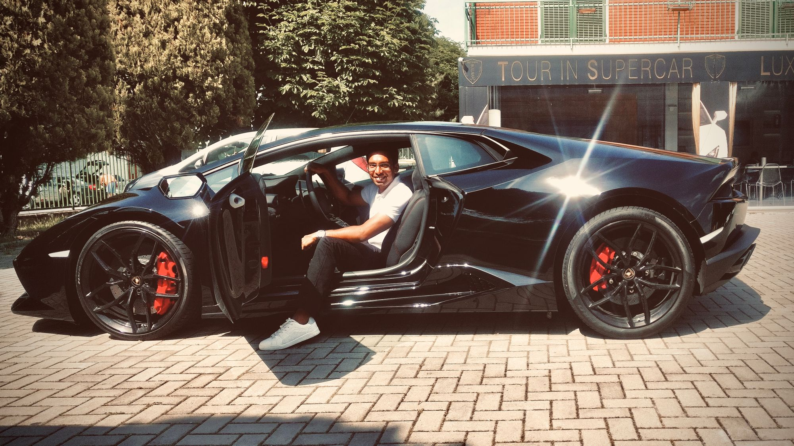

I walked towards his bed, sat on the chair next to the table, and asked, "Choose a date paaji".

"17th April 2017", he replied swiftly.

I threw him a devil smile.

“What for?”, he asked in confusion, with his left eyebrow going up.

“We’ll visit Lamborghini, Sant’agata, Italy“. We both looked at each other with affirmation…

Rachit Mazumdar is one of the rare people I know of who dares to nurture a wild dream. Wild! Of owning a Lamborghini!

He works with Carbon fibres already. Carbon fibres are lighter than steel and are orders of magnitude stronger than it. This material is what a Lambo is made of. His love for the machine is so intense, He can draw it with eyes closed and possibly knows all its dimensions.

You know, I am proud to have spent four years of my life with him and Sai (A post on Sai is incoming too). Pure bliss. It occurs to me today that these guys are Titans. It’s inbuilt in them. They have this attitude and passion for their dreams. They just don’t dream, they sacrifice the fun and do what’s right versus what feels right. When they work, they turn reality inside out. Some problems plague Rachit’s life, but chuck that for a moment.

My point is simply this, Rachit is going to own a Lamborghini, to begin with. And I can tell this with absolute certainty. No doubt. …It’ll take time… and he’ll be torn down (he’ll survive. He has been through worse, that too unprepared) but, …he’ll make it.

My bet is on him. Let the count down begin. Period.
